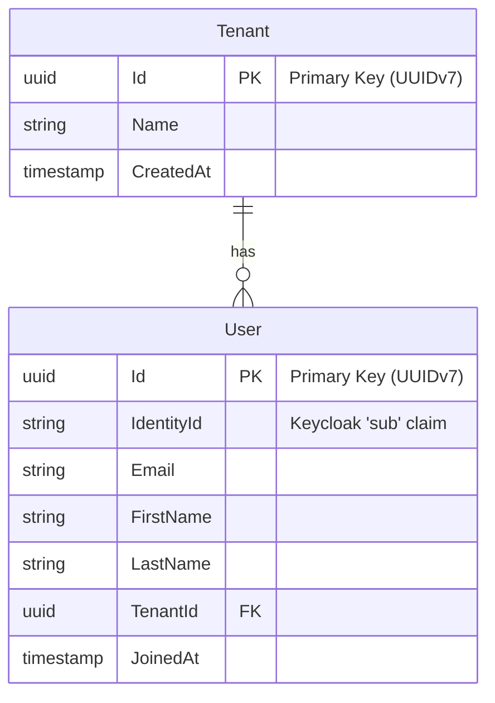

# Database Schema & Migrations

Nexora uses PostgreSQL with Entity Framework Core. To enforce our Modular Monolith boundaries at the database level, each module creates its own schema.

## Entity Relationship Diagram

## Module Schemas

### Identity Module (`"identity"`)
The `Identity` module owns the `"identity"` PostgreSQL schema. It is responsible for user mapping, synchronization with the IdP (Keycloak), and multi-tenancy.

| Table | Purpose |
|-------|---------|
| `"identity"."Tenants"` | Represents an Organization or Workspace. The `Id` of this table is injected via `ICurrentUserContext` into EF Core Global Query Filters to enforce strict data isolation. |
| `"identity"."Users"` | Represents a synced user. The `IdentityId` column holds the OIDC `sub` claim returned by Keycloak. |

### Global Query Filters (Multi-Tenancy)
All tables across all future modules that relate to tenant data will have a `TenantId` column. Entity Framework Core automatically enforces tenant boundaries via Global Query Filters using the scoped `ICurrentUserContext`.

*Note: For startup data seeders to bypass this filter, they must explicitly invoke `.IgnoreQueryFilters()`.*
